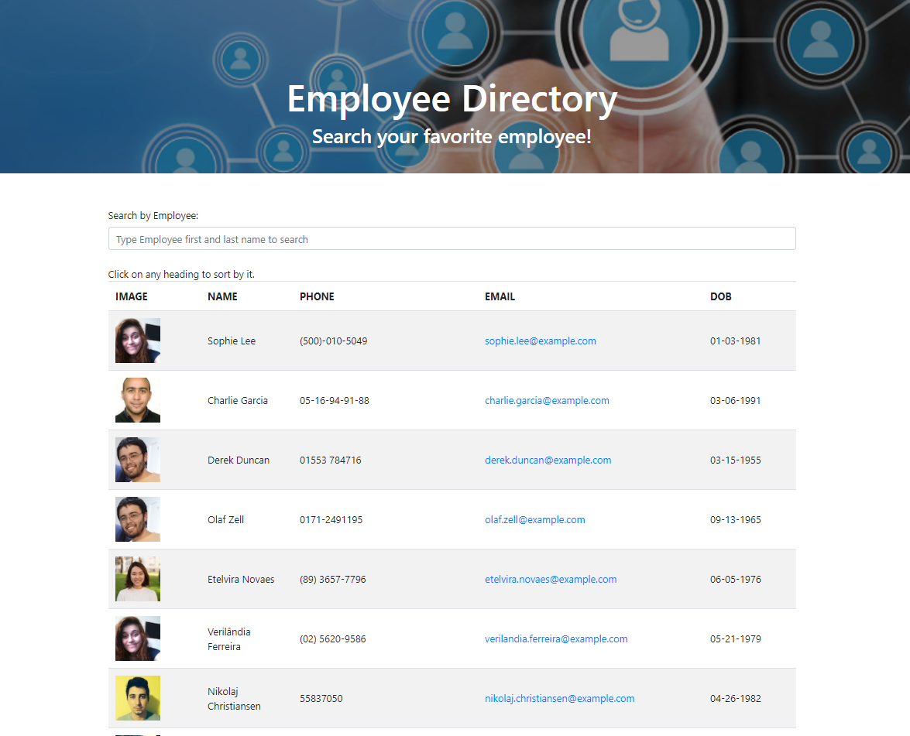
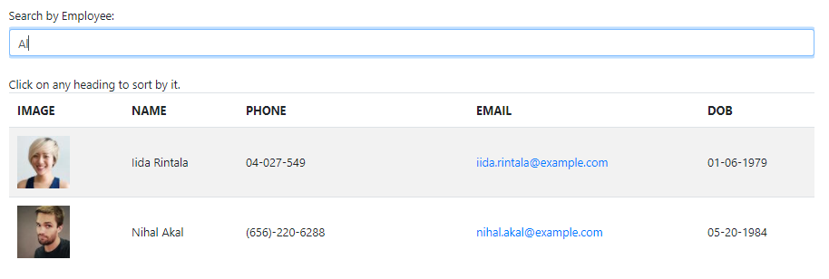
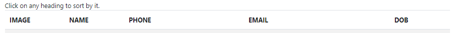

# Employee_Directory



[App Live](https://cesaraugustomartinez.github.io/Employees_Directory/)

---

### Table of Contents

- [Description](#description)
- [How to Use](#how-to-use)
- [Screenshots](#screenshots)
- [References](#references)
- [License](#license)
- [Author Info](#author-info)

---

## Description

The goal of this app is to create a employee directory with React. This application's UI is breaked up into components, component state, and responds to user events.

#### Technologies

- JavaScript
- NPM Modules
- Axios
- Visual Studio Code
- React.js
- Package.json
- API


##### Code sample - JavaScript - Importing React and components 
#

```js
import React from "react";
import { BrowserRouter as Router, Route } from "react-router-dom";
import Employees from "./pages/Employees";
import Footer from "./components/Footer";
import Wrapper from "./components/Wrapper";

function App() {
  return (
    <Router>
      <div>
        <Wrapper>
          <Route exact path="/" component={Employees} />
        </Wrapper>
        <Footer />
      </div>
    </Router>
  );
}

export default App;


```
##### Code sample - API.js to get data from a API using axios.
#
```js
 import axios from "axios";

export default {
  getRandomEmployee: function() {
    return axios.get("https://randomuser.me/api/?inc=id,picture,name,phone,email,dob&results=50");
  },
};


```


## How To Use

This application is Given a table of random users generated from the Random User API, when the user loads the page, a table of employees should render.

The user is able to:

- Sort the table by clicking on any of the heading fields.

- Filter the users by typing first and last name.


[Back To The Top](#Employee_Directory)
 
## Screenshots

- Filter typing in the input. 



- Sort clicking on any field. 




[Back To The Top](#Online-Offline-Budget-Trackers)

---

## References

- w3school -- [Node.js NPM](https://www.w3schools.com/nodejs/nodejs_npm.asp)
- NPM -- [Node Package Managment](https://www.npmjs.com/)
- Axios -- [Using Axios](https://www.npmjs.com/package/axios)
- React.js -- [About React.js](https://reactjs.org/docs/getting-started.html)
- json -- [The package.json guide](https://nodejs.dev/learn/the-package-json-guide)


[Back To The Top](#Employee_Directory)

---

## License

Copyright (c) [2020] [Cesar A Martinez]

[Back To The Top](#Employee_Directory)

---

## Author Info

- Twitter -- [@cesaguma](https://twitter.com/cesaguma)
- Linkedin -- [Cesar A Martinez](https://www.linkedin.com/in/cesar-augusto-martinez-auquilla/)
- GitHub -- [CesarAugustoMartinez](https://github.com/CesarAugustoMartinez)

[Back To The Top](#Employee_Directory)
